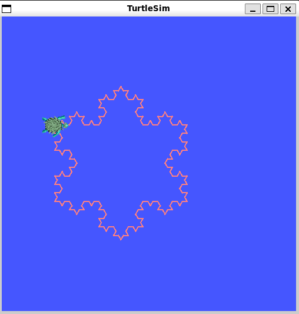

1. lépés le kell klónozni a publikus repót
2. be kell lépni a workspace mappába és buildelni a projektet
cd ros2_ws
colcon build --packages-select ros2_course
3. Forrás a setup filera(nem feltétlen kell mert a bashrc be benne van de fő a biztonság)
source install/setup.bash
4. Program indítása a következő paranccsal
ros2 launch ros2_course launch.py

Működés Részletei

Az indítófájl (launch.py)

Ez a fájl felelős a teljes alkalmazás elindításáért és konfigurálásáért.

Elindítja a turtlesim_node-ot, ami a szimulációs ablakot biztosítja.

Elindítja a projekt saját koch_snowflake node-ját a ros2_course csomagból.

A rajzolás megkezdése előtt egy rövid késleltetés után felemeli a teknős tollát egy ros2 service call paranccsal, hogy a teknős anélkül mozoghasson a kezdőpozícióba, hogy vonalat húzna.

Számos indítási argumentumot (DeclareLaunchArgument) definiál, amelyek lehetővé teszik a fraktál tulajdonságainak parancssorból történő testreszabását.

A rajzoló node (feleves.py) (inditásnál koch_snowflake.py a setup.py tartalma miatt)

Ez a node valósítja meg a fraktálrajzolás logikáját.

A node inicializáláskor beolvassa a launch fájlból átadott paramétereket.

Nem használja a hagyományos /cmd_vel topic-ot a mozgáshoz. Ehelyett klienseket hoz létre a turtlesim alábbi szolgáltatásaihoz:

teleport_absolute: A teknős abszolút pozícióba helyezéséhez.

teleport_relative: A teknős relatív elmozdításához és forgatásához.

set_pen: A toll színének, vastagságának és állapotának (le/fel) beállításához.

A koch() metódus egy rekurzív algoritmus, ami egy Koch-görbe szegmenst rajzol.

A draw() metódus a teknőst a kezdőpozícióba mozgatja, leteszi a tollat, majd háromszor meghívja a koch() metódust (közöttük -120 fokos fordulatokkal), hogy a teljes hópehely 
alakzat kirajzolódjon.

A program a rajzolás befejezése után leáll.

Használat és Paraméterezés

A projekt a ros2 launch paranccsal indítható. A fraktál tulajdonságai a parancs során paraméterekkel módosíthatók.

Alapértelmezett indítás:

ros2 launch ros2_course launch.py

Egyedi paraméterekkel való indítás:

A paramétereket a parameter_neve:=ertek formátumban lehet megadni. Például egy 4-ed rendű, zöld hópehely rajzolása:

ros2 launch ros2_course launch.py order:=4 pen_r:=0 pen_g:=255 pen_b:=0